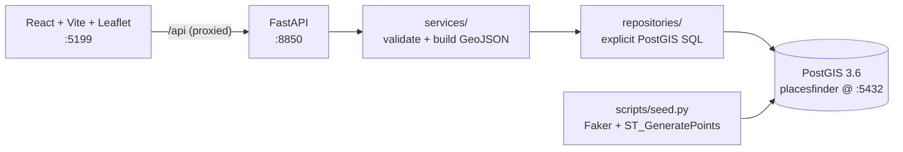
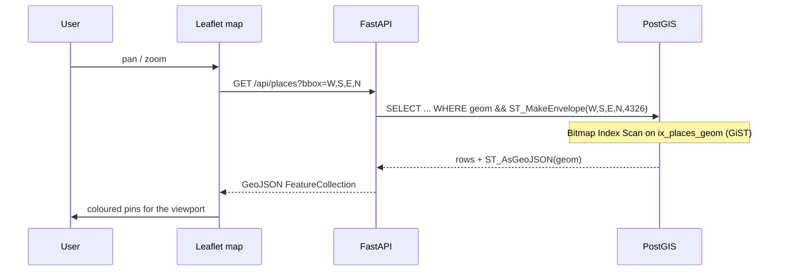
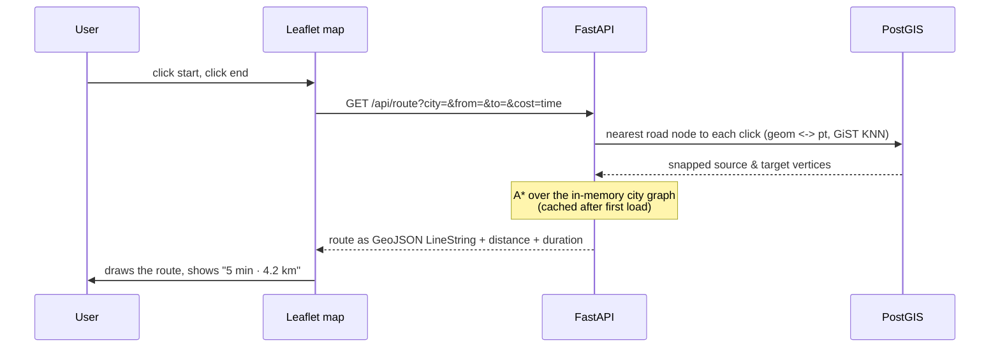

# Places Finder — a PostGIS learning app

An interactive map where you filter points-of-interest (cafés, restaurants,
shops, parks, bars, hotels) around San Francisco. Every filter on the map is
backed by a specific **PostGIS** query, so the project is a hands-on tour of
spatial SQL: bounding-box viewport search, radius search, nearest-neighbour,
point-in-polygon, and spatial aggregation — all rendered as GeoJSON on a
Leaflet map.

The core idea a change must not violate: **all spatial logic lives in
PostGIS** (in explicit SQL in the repository layer), not in Python. The point
of the project is to see the database do the geometry.

A second mode adds **routing** (directions) over real OpenStreetMap road
networks for three Bangladesh cities — Khulna, Dhaka, Chattogram — showing the
*other* half of a maps app: shortest-path search over a graph. PostGIS stores
the graph and snaps clicks to the nearest road; a hand-written **A\*** finds the
route. See [Routing](#routing-directions) below.

## Stack

| Layer | Tech |
|---|---|
| Database | PostgreSQL + **PostGIS 3.6** (shared instance on `:5432`, dedicated `placesfinder` DB) |
| Backend | FastAPI · SQLAlchemy 2 · GeoAlchemy2 · psycopg · Alembic (`:8850`) |
| Frontend | React 18 · TypeScript · Vite · Tailwind · Leaflet (`:5199`) |
| Tooling | uv · Ruff · mypy · pytest |

## Architecture



Layering is one-directional: `api → services → repositories → db`. Routers
only parse/serialize; services hold validation and GeoJSON assembly;
repositories hold the SQL.

## PostGIS concept → feature map

| Map interaction | PostGIS | Endpoint |
|---|---|---|
| Pins load for the current viewport | `geom && ST_MakeEnvelope(...)` (GiST bbox) | `GET /api/places?bbox=` |
| Radius search around a dropped point | `ST_DWithin(geom::geography, pt, m)` | `?lat&lng&radius_m=` |
| Sort by nearest | `geom::geography <-> pt` (KNN) | `?sort=nearest` |
| Distance to a point | `ST_Distance(geom::geography, pt)` | returned as `distance_m` |
| Attribute filters | `WHERE category/rating/…` | query params |
| Click a neighbourhood → its places | `ST_Contains(n.geom, p.geom)` | `GET /api/neighborhoods/{id}/places` |
| Counts per neighbourhood (choropleth) | `ST_Contains` + `GROUP BY` | `GET /api/neighborhoods/stats` |
| Geometry → map | `ST_AsGeoJSON(geom)` | all read endpoints |

## Sequence — a viewport (bbox) search



## Running it

Prerequisite: a PostGIS container on `:5432` with a `placesfinder` database and
the `postgis` extension enabled (see `backend/.env.example` for the connection
string).

```bash
make install        # backend (uv) + frontend (npm) deps
make migrate        # create tables + GiST indexes
make seed           # ~510 places + 6 neighbourhoods around San Francisco
make ingest-roads   # fetch OSM road graphs for the 3 Bangladesh cities (routing)
make dev-api        # http://localhost:8850  (docs at /docs)
make dev-ui         # http://localhost:5199
```

`make check` runs the full gate: Ruff + mypy + tsc + pytest.

## Routing (directions)

The **Routing (BD)** tab in the UI routes over real OpenStreetMap road
networks. `scripts/ingest_roads.py` pulls drivable `highway` ways from the
Overpass API for three central-city bounding boxes (Khulna, Dhaka, Chattogram),
turns them into a graph (`road_nodes` vertices + `roads` edges, each edge costed
by travel time), and bulk-loads them into PostGIS.

Routing is **not** pgRouting — it isn't available in the shared container — so
we implement it ourselves, which is more instructive anyway:



| Interaction | Tech | Endpoint |
|---|---|---|
| List city networks + centers | `ST_Extent` / `ST_Centroid` | `GET /api/route/cities` |
| Snap a click to the nearest road | `geom <-> pt` (GiST KNN) | inside `/api/route` |
| Fastest / shortest route | hand-written **A\*** (time or distance cost) | `GET /api/route?cost=time\|distance` |

`cost=time` and `cost=distance` genuinely diverge: the fastest route can be
*longer* (it prefers main roads) while the shortest can be *slower* (back
streets) — the same trade-off Google surfaces.

## Adding your own data

`make seed` / `make ingest-roads` load the predefined fixtures. To build your
own from a blank database, use the management CLI
([`scripts/manage.py`](backend/scripts/manage.py)) — no code changes needed:

```bash
make manage ARGS="stats"                       # counts of places/neighbourhoods/roads

# a single place  (--at lat,lng)
make manage ARGS='add-place "Blue Bottle" cafe --at 37.776,-122.423 --rating 4.6'

# a neighbourhood rectangle  (--bbox min_lon,min_lat,max_lon,max_lat)
make manage ARGS='add-neighborhood "Downtown" --bbox=-122.42,37.77,-122.40,37.79'

# 200 synthetic places in a bbox, plus a neighbourhood covering it
make manage ARGS='generate-places --bbox=-122.46,37.74,-122.39,37.81 --count 200 --neighborhood "My Area"'

# a routable road network for ANY area (fetched live from OpenStreetMap)
make manage ARGS='add-city-roads sylhet --bbox 91.855,24.885,91.895,24.915'
make manage ARGS='clear-roads sylhet'          # remove it again
```

A city added with `add-city-roads` is immediately routable — it shows up in
`GET /api/route/cities` and the frontend's city dropdown with no restart.

> **Coordinates are comma-separated strings**, so a leading minus isn't mistaken
> for a CLI flag. If a value *starts* with `-`, use the `--opt=value` form (with
> the equals sign), e.g. `--bbox=-122.42,...`. All bboxes use the same order as
> the `/api/places` API: `min_lon,min_lat,max_lon,max_lat`.

## Learning the spatial SQL

See [`docs/postgis-reference.md`](docs/postgis-reference.md) — a hands-on
cheat-sheet of the core `ST_*` functions (constructors, accessors, measurement,
predicates, derivation), each with a runnable query, real output, and notes.
It uses a small self-contained demo dataset, so you can follow along in `psql`
without touching the app's tables.

## Layout

```
backend/
  app/
    api/            # routers: places, neighborhoods (parse + serialize only)
    core/           # config, db session
    models/         # SQLAlchemy: Place (Point), Neighborhood (Polygon)
    schemas/        # Pydantic: filter params + GeoJSON out
    services/       # validation + GeoJSON assembly
    repositories/   # the PostGIS SQL
  migrations/       # Alembic
  scripts/
    seed.py         # synthetic places + neighbourhoods (SF)
    ingest_roads.py # OSM road graphs for the predefined cities
    manage.py       # Typer CLI: add your own places/neighbourhoods/city roads
  tests/            # unit (validation, A*) + integration (API vs live DB)
frontend/
  src/
    api.ts          # typed client
    App.tsx         # filter state + query-mode orchestration
    components/     # MapView, FilterPanel
```

## Conventions & gotchas

- **SRID 4326 (WGS84 lon/lat)** everywhere. GeoJSON is always `[lon, lat]`;
  Leaflet wants `[lat, lng]` — the frontend flips them at the boundary.
- **Migrations freeze their values** (SRID, column types are literals in the
  revision) — never read live app config from a migration.
- **Meters need geography.** `ST_DWithin` / `ST_Distance` / KNN on raw
  geometry measure planar degrees. Cast to `::geography` for true metres —
  and note that `geom <-> pt` (planar) sorts *differently* from
  `geom::geography <-> pt::geography` (metres) for lon/lat. We use the
  geography form for nearest so the order matches the returned `distance_m`.
- **The geography cast needs its own index.** The `ix_places_geom` GiST index is
  on the raw geometry, so it powers the `&&` viewport query — but it does *not*
  match `ST_DWithin(geom::geography, …)`, which would seq-scan without help.
  Migration `0002` adds a functional index `ix_places_geog` on
  `(geom::geography)` so radius and nearest queries are index-accelerated too.
  A test asserts the radius query's plan uses it (`EXPLAIN` must not `Seq Scan`).
- **Frontend/Leaflet:** the map is rendered with `preferCanvas`, so markers and
  polygons draw to a `<canvas>` (not DOM nodes). The map mounts before its
  flex container has height, so we call `map.invalidateSize()` on the next
  animation frame and then emit the initial bounds; a zero-area bbox is guarded
  out (the backend rightly rejects `min >= max`).
- Neighbourhood polygons are kept **disjoint** so the choropleth counts sum to
  the number of places inside any neighbourhood (no double-counting).
- **Routing gotchas.** OSM intersections need no special handling — two ways
  that cross share the same OSM node id, so they share a graph vertex
  automatically. The Overpass API rate-limits (HTTP 429); the ingest script
  retries with backoff, pauses between cities, and skips already-loaded cities.
  Each city graph is loaded from PostGIS into memory once and cached (first
  route ~180 ms, cached ~30 ms). Switching map mode/city **remounts** the Leaflet
  map via a `key` (mounting directly at the new center) rather than `flyTo`,
  which was unreliable across the large SF↔Bangladesh jump; on mode switch the
  stored viewport is cleared so a stale bbox from the other mode isn't queried.
